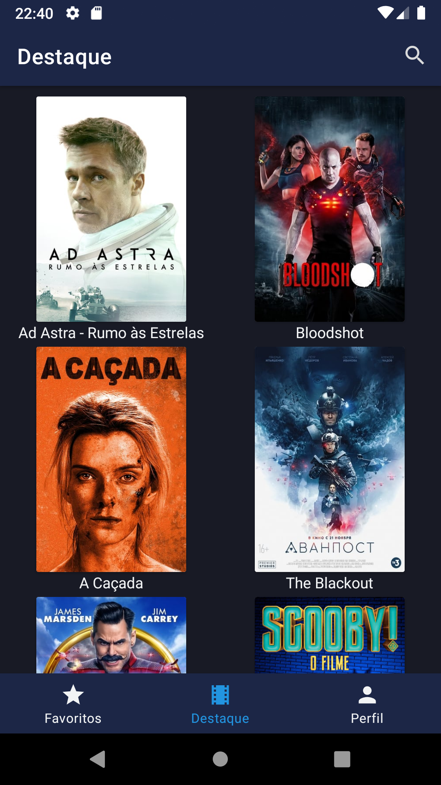
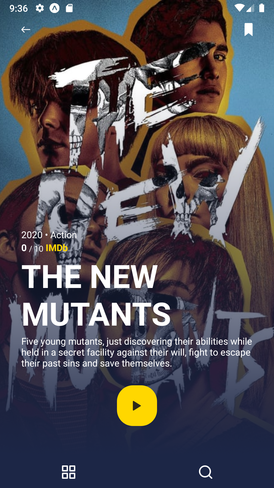

# Cinema Club

> React Native (Expo) Movie App

[](https://badge.fury.io/gh/rodrinac%2Fcinemaclub)

This is a React Native application based on Expo using the [TMDB api](https://www.themoviedb.org/).



## Installation

Yarn:

```sh
yarn
```

NPM:

```sh
npm install
```

## Dev

Yarn:

```sh
yarn start
```

NPM:

```sh
npm start
```

## Milestones

- [x] Start Page.
- [x] Movies Search Page
- [x] Movie Details Page
- [x] Splash Screen
- [ ] TMDB Authentication
- [ ] Favorites Page
- [ ] User lists
- [ ] i18n
- [ ] Tests (:D)
- [ ] ... what more?

## Release History

- beta01
  - Work in progress

## Meta

José Inácio – [👨‍💻 @josersinacio](https://www.linkedin.com/in/josersinacio/) – jose.rs.inacio@gmail.com

Distributed under the MIT license. See `LICENSE` for more information.

## Contributing

1. Fork it (<https://github.com/rodrinac/cinemaclub/fork>)
2. Create your feature branch (`git checkout -b feature/fooBar`)
3. Commit your changes (`git commit -am 'Add some fooBar'`)
4. Push to the branch (`git push origin feature/fooBar`)
5. Create a new Pull Request
