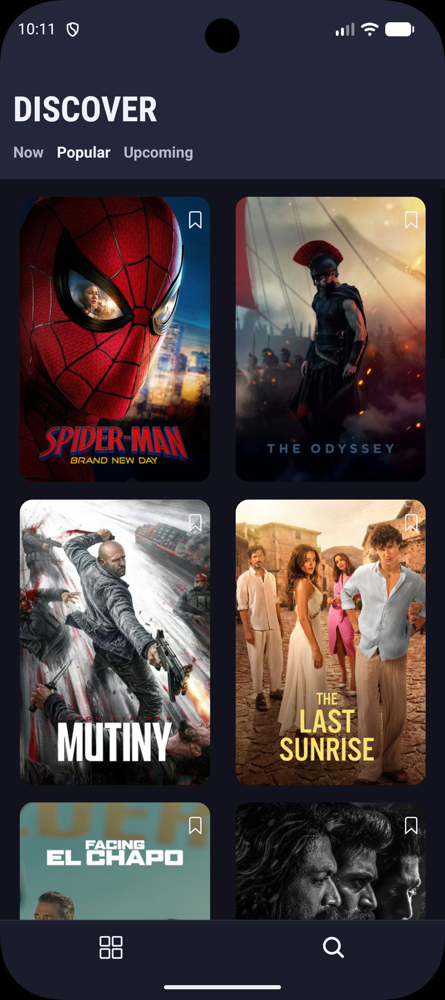
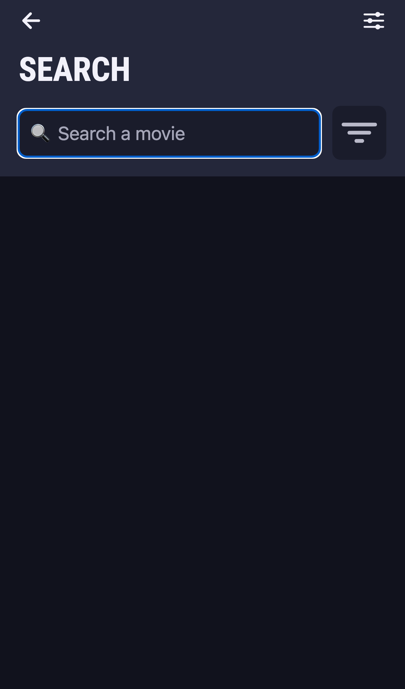
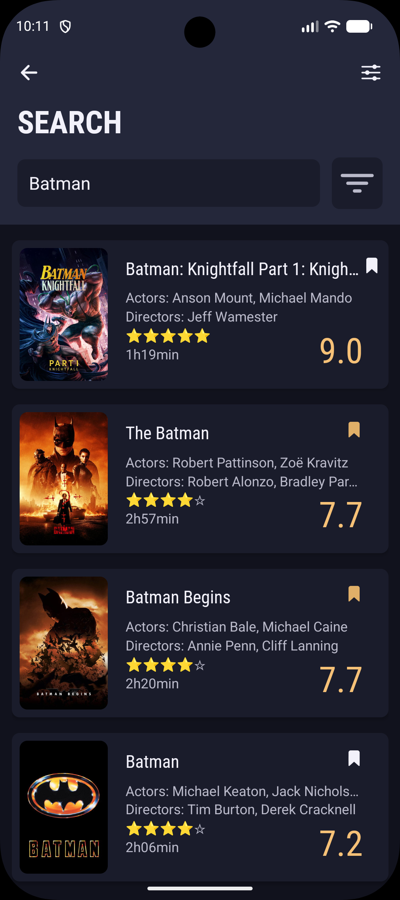

# Cinema Club 🎬✨

> A cozy React Native (Expo) movie app with web support, powered by TMDB.

[](https://badge.fury.io/gh/rodrinac%2Fcinemaclub)

Cinema Club keeps movie discovery fun and clean across web + mobile, while routing all TMDB access through a local API layer.

## App peek (live mobile captures)



## Installation

```sh
npm install
```

## Development

```sh
# 1) Copy .env.template to .env and set TMDB_API_TOKEN
npm run api

# 2) In a second terminal, run Expo (web / iOS / Android)
npm start
```

The Expo app talks only to the Movies API proxy. The TMDB bearer token is read by that API from `.env` locally or Secrets Manager in AWS, and it never gets embedded in the client app. On a physical device, set `EXPO_PUBLIC_MOVIES_API_URL` to your machine's LAN address, for example `http://192.168.1.10:3001/api`.

The local API defaults to **no CORS headers** and **no in-memory rate limiting**. If you want to exercise the web app from a different origin locally, set `CORS_ALLOW_ORIGIN` to that exact origin before starting `npm run api`.

## Movies API

`npm run api` starts a small read-only API on port `3001`. The AWS deployment uses API Gateway REST API -> Node.js Lambda -> TMDB and keeps the same `/api` contract by setting `EXPO_PUBLIC_MOVIES_API_URL` to `<stage invoke url>/api`.

- `GET /health`
- `GET /api/movies/now-playing`, `/api/movies/popular`, `/api/movies/upcoming`
- `GET /api/movies/:id`
- `GET /api/search/movies?query=...`
- `GET /api/genres`
- compatibility aliases: `/api/movie/*`, `/api/search/movie`, `/api/genre/movie/list`

### EAS remote builds

- Local `.env` files are for local development only and are not uploaded to EAS Build.
- Remote EAS preview/production builds must set `EXPO_PUBLIC_MOVIES_API_URL` in the matching EAS environment.
- `EXPO_PUBLIC_MOVIES_API_URL` is public/plaintext because Expo embeds it in the client bundle.
- `TMDB_API_TOKEN` stays server-only and must never be exposed through `EXPO_PUBLIC_*`.
- The EAS pre-install guard fails remote preview/release builds when the public Movies API URL is missing, blank, localhost-style, or pointed at TMDB directly.
- Production web releases run through the serialized GitHub Actions workflow
  `.github/workflows/deploy-aws-proxy.yml`: it deploys the AWS proxy first,
  resolves the live API Gateway `/api` URL via GitHub OIDC, writes that value to
  the EAS `production` environment, runs `npm run build:web:production`, and
  then deploys the generated `dist` export to Expo Hosting production.
- The GitHub `production` environment must include `EXPO_TOKEN` so CI can update
  the EAS `production` environment and publish the hosting release.

```sh
eas env:set production --name EXPO_PUBLIC_MOVIES_API_URL --value https://<stage invoke url>/api --visibility plaintext --scope project
eas env:list --environment production
npm run build:web:production
npx eas deploy --environment production --prod
```

`npm run build:web:production` performs a clean web-only Expo export using the remote
`production` EAS environment. Deploy that newly generated `dist` with
`npx eas deploy --environment production --prod`. The `EXPO_PUBLIC_MOVIES_API_URL`
value must always be the deployed AWS API Gateway proxy URL ending in `/api`.
`npm run build:web` remains the local/CI export command.

### Example movie details response

Sample payload: `tests/e2e/fixtures/movie-details.example.json`

## Testing

```sh
npm run test
node --test tests/tmdb-lambda.test.mjs
npm run test:e2e:stub
npm run test:e2e:live
```

## Spider-Man universe banners

Banner visual references/inspirations used for this project:

- [Spider-Man: Into the Spider-Verse – Official posters (TMDB)](https://www.themoviedb.org/movie/324857-spider-man-into-the-spider-verse/images/posters)
- [Spider-Man: Across the Spider-Verse – Official posters (TMDB)](https://www.themoviedb.org/movie/569094-spider-man-across-the-spider-verse/images/posters)
- [Spider-Man: Beyond the Spider-Verse – Title/brand references (Sony Pictures)](https://www.sonypictures.com/movies/spidermanbeyondthespiderverse)

## Meta

José Inácio – [👨‍💻 @josersinacio](https://www.linkedin.com/in/josersinacio/)

Distributed under the MIT license. See `LICENSE` for more information.

## Contributing

1. Fork it (<https://github.com/rodrinac/cinemaclub/fork>)
2. Create your feature branch (`git checkout -b feature/fooBar`)
3. Commit your changes (`git commit -am 'Add some fooBar'`)
4. Push to the branch (`git push origin feature/fooBar`)
5. Create a new Pull Request
